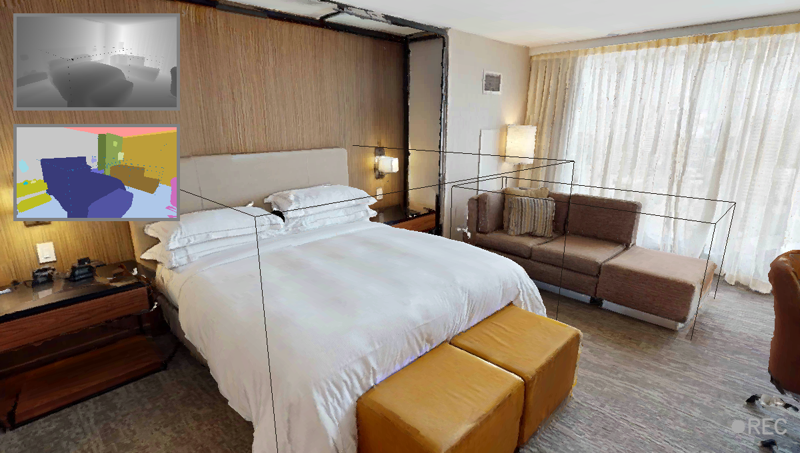

# Configuration Reference: `habitat_data_collector.yaml`

This document provides an SIMPLE overview of the configuration options for the Habitat Data Collector. The path of configuration:  `config/habitat_data_collector.yaml`

---

## 📁 Scene Output Settings


```yaml
dataset_name: hm3d
output_path: /path/to/output
scene_name: 00829-QaLdnwvtxbs
```

- `dataset_name`: Dataset identifier (e.g., `hm3d`, `mp3d`, `replica`).
- `output_path`: Directory where output data will be saved.
- `scene_name`: Scene identifier used for organizing output

The collected data will be saved under the path:
```
${output_path}/${dataset_name}/${scene_name}_X
```
where X denotes the run index (e.g., *.../00829-QaLdnwvtxbs_0* for the first run). This ensures outputs from multiple runs are stored without overwriting.

---

## 🗺️ Scene Configuration

```yaml
load_from_config: false
scene_config: /path/to/scene_config.json

scene_path: /path/to/scene.glb
scene_dataset_config: /path/to/scene_dataset_config.json
```

- `load_from_config`: If `true`, the scene will be loaded using the provided `scene_config`.
- `scene_config`: Path to a dynamic scene configuration file. This file includes all manually added objects and supports reproduction of pre-arranged environments.
- `scene_path`: Direct path to the raw scene asset file (e.g., `.glb`, `.ply`).
- `scene_dataset_config`: Path to the dataset-specific configuration file.

> Commented-out paths for **HM3D**, **MP3D**, and **Replica** are included in the YAML for reference.

There are two modes for loading a scene:

1. **Raw scene loading**: Directly load the scene asset provided by datasets such as HM3D or Replica. This will render the original environment without any manually placed objects. The detailed usage and directory layout for each dataset are described in [dataset setup guide](../dataset/dataset.md).

2. **Pre-arranged scene loading**: Load the full scene setup from a saved `scene_config` file. This includes the base scene along with user-defined object placements. This is the recommended approach for reproducible experiments or synthetic scene generation. Setup and saving procedures are explained in `usage.md`.

> Note: Scene config functionality is currently not supported for **Replica** due to technical limitations ([see issue](https://github.com/facebookresearch/habitat-sim/issues/2484#issuecomment-2461778776)).

---

## 🎯 Object Configuration

```yaml
objects_path: /path/to/objects
```

- `objects_path`: Directory containing object assets (GLB models) to be inserted during simulation. Currently we support the [YCB objects](https://www.ycbbenchmarks.com/). Detailed information can be found in [dataset setup guide](../dataset/dataset.md)

---

## 🎥 Sensor and Camera Settings

```yaml
data_cfg:
  seed: 12
  rgb: true
  depth: true
  semantic: true
  resolution:
    w: 1200
    h: 680
  camera_height: 1.5
```

- `seed`: Random seed for reproducibility and the initial start point.
- `rgb`, `depth`, `semantic`: Enable/disable specific sensor outputs.
- `resolution`: Image dimensions in pixels.
- `camera_height`: Camera height from the ground (meters). Set as the height of robot.

---

## 🕹️ Agent Movement

```yaml
movement_cfg:
  move_forward: 0.4
  move_backward: 0.4
  turn_left: 3
  turn_right: 3
  look_up: 3
  look_down: 3
```

- Configures agent control speeds (in meters/second or degrees/frame depending on action).

---


## 🧱 Placable Categories

```yaml
placable_categories:
  - table
  - counter
  - desk
  ...
show_placable_categories: false
```

- `placable_categories`: List of object categories that can be placed. ONLY the objects witin this list can be placed with other objects for add and delete operation.
- `show_placable_categories`: Visualize bounding boxes for debug or room arrangement.

<div align="center">
  
  <p>
    <em>Example: bounding boxes rendered for placable object categories.</em>
  </p>
</div>


---

## 📡 ROS2 Integration

```yaml
use_ros: true
record_rosbag: true
```

- `use_ros`: Enable ROS2 publishers.
- `record_rosbag`: Optionally record ROS bags during RECORDING. See `usage.md` for detail.

---

## 🧩 Miscellaneous

```yaml
frame_rate: 30.0
id_handle_dict: {}
```

- `frame_rate`: Simulation frequency in frames per second.
- `id_handle_dict`: Placeholder for mapping semantic IDs to object handles (reserved for internal use).

---

## 📝 Notes

- All paths should be updated by users to reflect their local or shared dataset structure.
- Absolute paths in the default configuration are only valid in the developer’s local environment.

