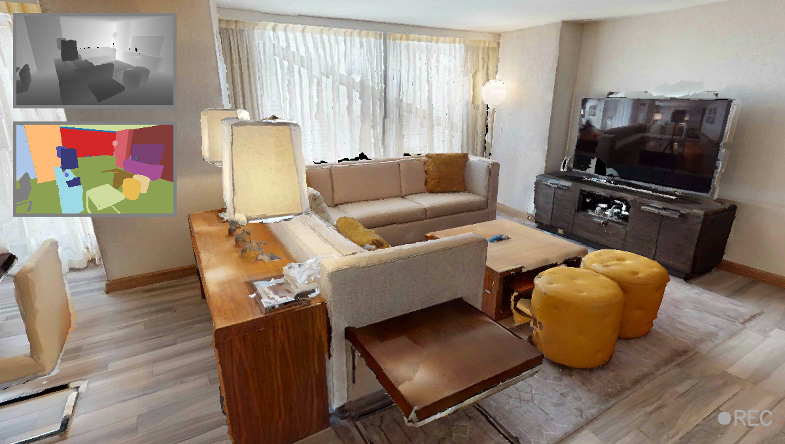
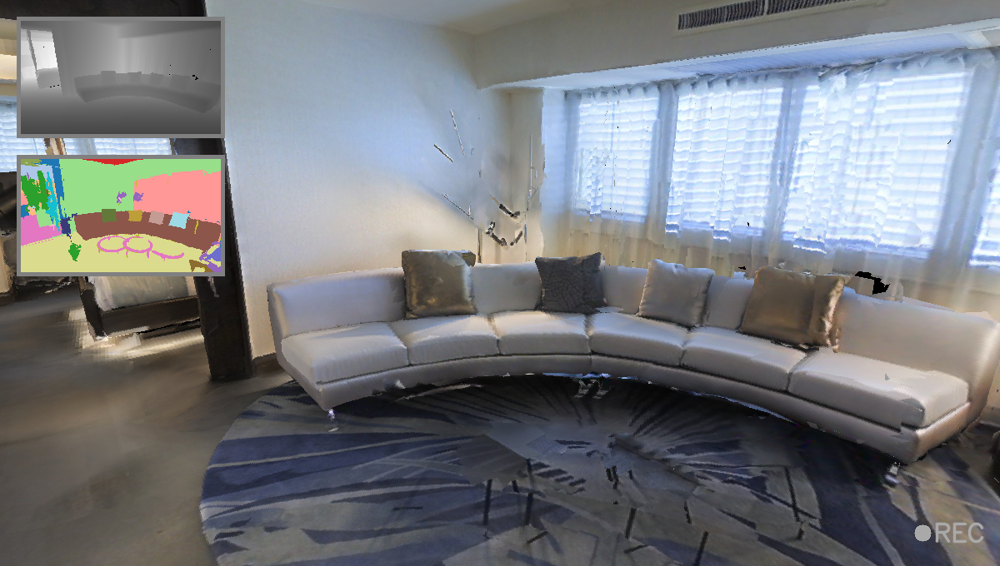
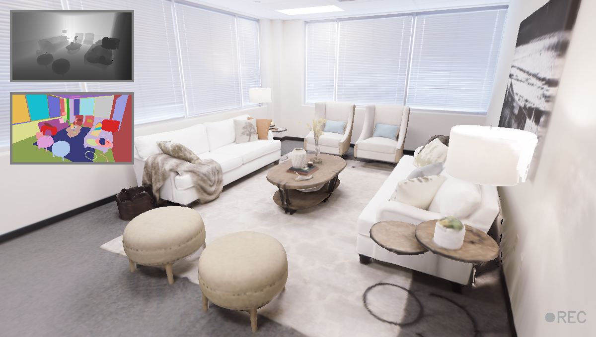

# 🗂️ Dataset Setup

This repository is built on top of [Habitat-Sim](https://github.com/facebookresearch/habitat-sim).  
In this document, we explain how to set up the following datasets for use with the Habitat Data Collector:

- [Habitat-Matterport 3D Research Dataset (HM3D)](#-habitat-matterport-3d-research-dataset-hm3d)
- Matterport3D (MP3D)
- Replica
- Object placements using YCB assets

For general dataset guidance, refer to the [Habitat Dataset Documentation](https://github.com/facebookresearch/habitat-sim/blob/main/DATASETS.md).

---

## Habitat-Matterport 3D Research Dataset (HM3D)

- Details: https://aihabitat.org/datasets/hm3d/
- Access: https://matterport.com/habitat-matterport-3d-research-dataset
- GitHub (download tools): https://github.com/matterport/habitat-matterport-3dresearch

### HM3D Dataset Structure

Make sure the dataset is downloaded and organized as follows:

```
<PATH TO HM3D>/
├── hm3d_annotated_basis.scene_dataset_config.json
├── hm3d_basis.scene_dataset_config.json
├── train/
├── val/
└── minival/

<PATH TO HM3D>/val/00829-QaLdnwvtxbs/
├── QaLdnwvtxbs.basis.glb
├── QaLdnwvtxbs.glb
├── QaLdnwvtxbs.basis.navmesh
├── QaLdnwvtxbs.semantic.glb
└── QaLdnwvtxbs.semantic.txt
```

✅ Make sure the following files exist:
- `*.semantic.glb`
- `*.semantic.txt`
- `hm3d_annotated_*.scene_dataset_config.json`

These files are required for rendering semantics in the simulator.

### Configuration

Refer to the [Scene Configuration](documents/config_reference/config_reference.md#-scene-configuration) section for more.

Example (using `00829-QaLdnwvtxbs`):

```yaml
scene_path: <PATH TO HM3D>/val/00829-QaLdnwvtxbs/QaLdnwvtxbs.basis.glb
scene_dataset_config: <PATH TO HM3D>/val/hm3d_annotated_basis.scene_dataset_config.json
```

<div align="center">
  
  <p><em>Example: HM3D Scene in Habitat-data-collector.</em></p>
</div>

---

## Matterport3D (MP3D) Dataset

- Details: https://niessner.github.io/Matterport/
- GitHub: https://github.com/niessner/Matterport

You only need the Habitat-compatible zip archive, not the full dataset.

Place the `scene_dataset_config` file in the root directory of the dataset, such as:

```
Habitat-Sim/data/scene_datasets/mp3d/
```

### Configuration

```yaml
scene_path: <PATH TO MP3D>/17DRP5sb8fy/17DRP5sb8fy.glb
scene_dataset_config: <PATH TO MP3D>/mp3d_example/mp3d.scene_dataset_config.json
```

<div align="center">
  
  <p><em>Example: MP3D Scene in Habitat-data-collector.</em></p>
</div>

---

## Replica Dataset

- Dataset & instructions: https://github.com/facebookresearch/Replica-Dataset

### Directory Structure

```
<PATH TO Replica>/
├── apartment_0/
├── room_0/
│   └── habitat/
│       ├── mesh_semantic.ply
│       ├── info_semantic.json
│       └── replica_stage.stage_config.json
├── replica.scene_dataset_config.json
...
```

### Configuration

```yaml
scene_path: <PATH TO Replica>/room_0/habitat/mesh_semantic.ply
scene_dataset_config: <PATH TO Replica>/replica.scene_dataset_config.json
```

⚠️ **Note:** You may encounter an upside-down scene issue. To fix it, manually update the `replica.scene_dataset_config.json` file like this:

```json
"shader_type": "flat",
"up": [0, 1, 0],
"front": [0, 0, -1]
```

<div align="center">
  
  <p><em>Example: Replica Room_0 Scene in Habitat-data-collector.</em></p>
</div>

---

## YCB Benchmarks – Object and Model Set

- Details: https://www.ycbbenchmarks.com/

### Structure

```
<PATH TO YCB>/
├── configs/
│   ├── 002_master_chef_can.object_config.json
│   ├── 003_cracker_box.object_config.json
│   ├── ...
├── meshes/
├── collision_meshes/
├── ycb.scene_dataset_config.json
```

### Configuration

Use the following to load objects for insertion:

```yaml
objects_path: <PATH TO YCB>/configs
```

By default, the YCB dataset includes many objects. You can **selectively load** specific objects by copying only their config files to a reduced `configs/` directory.

Example (used in internal testing):

```
003_cracker_box.object_config.json
005_tomato_soup_can.object_config.json
011_banana.object_config.json
019_pitcher_base.object_config.json
024_bowl.object_config.json
025_mug.object_config.json
029_plate.object_config.json
037_scissors.object_config.json
```

<div align="center">
  
  <p><em>Example: Setting YCB Objects in HM3D-00829 Scene in Habitat-data-collector.</em></p>
</div>
