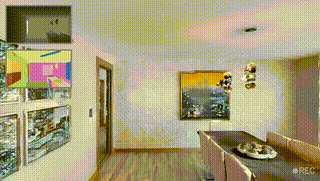
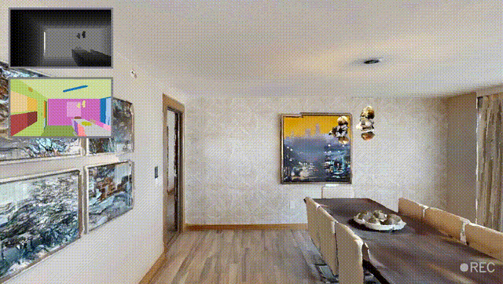
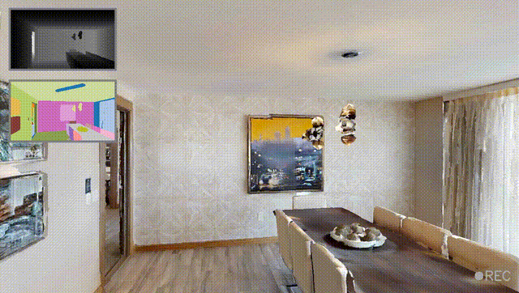
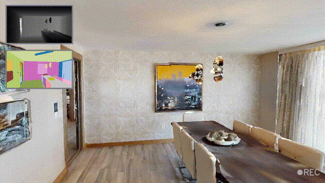
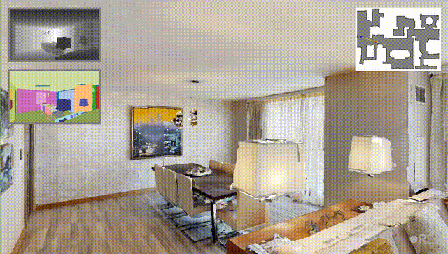
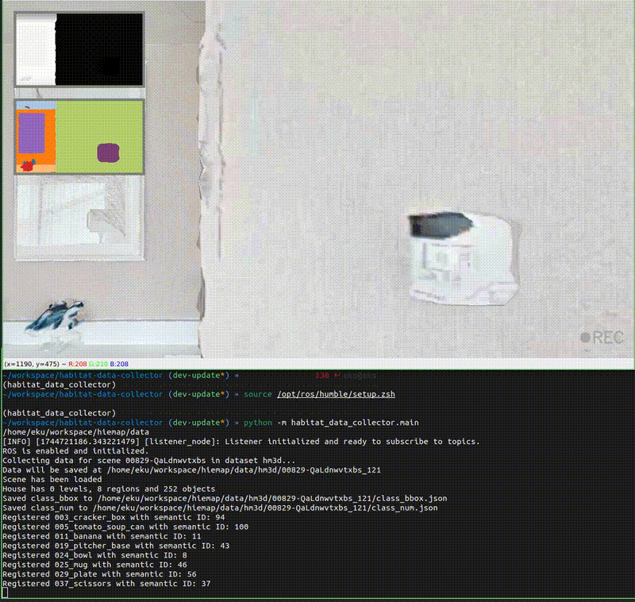
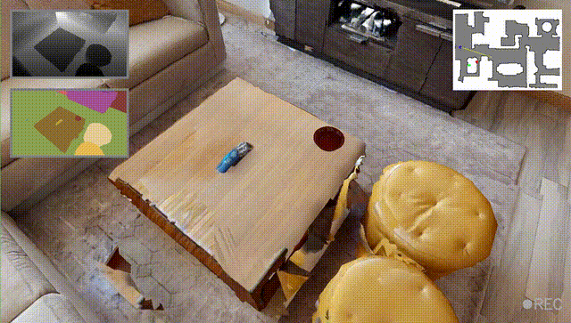
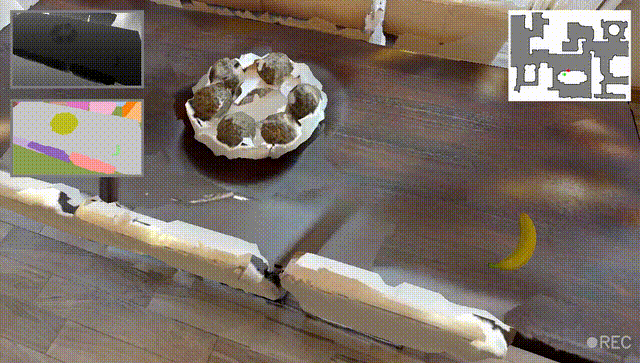
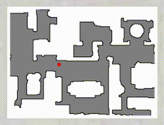

# Usage Guide

## Movement Controls

| Key(s)           | Action                    | Preview |
|------------------|----------------------------|---------|
| `W` / `S`        | Move forward / backward    |  |
| `A` / `D` or `←` / `→` | Rotate left / right view |  |
| `↑` / `↓`         | Look up / down             |  |

See [Agent Movement Configuration](../config_reference/config_reference.md#-agent-movement) for details of setting scale of the movement.


## Functional Controls

| Key      | Action                                                                 | Preview              |
|----------|------------------------------------------------------------------------|----------------------|
| `q`      | Exit the tool and save the recording                                    |                      |
| `m`      | Toggle top-down map view                                                |  |
| `n`      | Select a point on the map and start navigation                          |  |
| `e`      | Save all placed objects and generate `scene_config.json`               |                      |
| `space`  | Start or stop recording (toggle)                                        |  |


### Scene Config Saving -> `e` 

The scene configuration (`scene_config.json`) stores user-placed object positions to enable future reproducibility. After arranging objects in the scene, press `e` to save their locations. This file can be reloaded later to restore the same arrangement.

Once saved, you will see this message in the terminal:

```bash
Configuration saved to ${output_path}/${dataset_name}/${scene_name}_X/scene_config.json
```

To reload, refer to the guide in [Scene Configuration](../config_reference/config_reference.md#-scene-configuration).


### Recording -> `space` 

The recording system captures both raw data and optionally a ROS2 bag, based on the config file.

> **Note:** To enable ROS bag recording, set `record_rosbag: true` in `habitat_data_collector.yaml`.
> 
> **Note:** Be sure to configure the output path properly in [Scene Output Settings](../config_reference/config_reference.md#-scene-output-settings).

When you press `space`, recording starts. A blinking red `REC` indicator appears in the bottom right corner. You will also see messages like:

```bash
Recording started
Start ROS bag recording: ${output_path}/${dataset_name}/${scene_name}_X/rosbag2
[INFO] [rosbag2_recorder]: Press SPACE for pausing/resuming
[INFO] [rosbag2_storage]: Opened database '.../rosbag2_0.db3' for READ_WRITE.
...
[INFO] [rosbag2_recorder]: Recording...
[INFO] [rosbag2_recorder]: Subscribed to topic '/camera/depth/image_raw'
[INFO] [rosbag2_recorder]: Subscribed to topic '/camera/rgb/image_raw'
[INFO] [rosbag2_recorder]: Subscribed to topic '/camera/pose'
[INFO] [rosbag2_recorder]: Subscribed to topic '/camera_info'
```

Press `space` again to stop recording:

```bash
Recording stopped
[INFO] [rosbag2_cpp]: Writing remaining messages from cache to the bag.
[INFO] [rosbag2_recorder]: Event publisher thread: Exiting
[INFO] [rosbag2_recorder]: Recording stopped
```

You may continue interacting with the simulation. To finalize and save the recording, press `q`. You will see:

```bash
Replay the recording and saving to disk...
Replaying and saving: 100%|██████████████████████████| 54/54 [00:05<00:00, 10.69it/s]
Replay and saving obs and pose completed in ${output_path}/${dataset_name}/${scene_name}_X
```

The following structure will appear in your output directory:

```
${output_path}/${dataset_name}/${scene_name}_X
├── camera_intrinsics.json
├── class_bbox.json
├── class_num.json
├── depth/
│   ├── 1744721112.0172191.png
│   └── ...
├── rgb/
│   ├── 1744721112.0172191.png
│   └── ...
├── pose.txt
└── rosbag2/
    ├── metadata.yaml
    └── rosbag2_0.db3
```

- `class_bbox.json`: Contains bounding boxes for each category.
- `class_num.json`: Tracks the number of each category present.
- `depth/`, `rgb/`: Image frames saved with timestamps.
- `pose.txt`: Stores camera poses as 4x4 transformation matrices.

<div align="center">
  
  <p><em>Example: Recording process visualization</em></p>
</div>

## Object Interaction

| Key      | Action                                                                 | Preview |
|----------|------------------------------------------------------------------------|---------|
| `+`      | Randomly add an object on a placeable surface                          |  |
| `-`      | Randomly delete an object from the scene                               |  |
| `p`      | Add an object to the currently viewed placeable surface                |  |
| `g`      | Grab the nearest object                                                |  |
| `r`      | Place the currently grabbed object on the nearest placeable surface    |  |


### Add/Delete Objects (`+` / `-`)

All object candidates are defined in the object directory, such as objects from the YCB dataset. See [Object Configuration](../config_reference/config_reference.md#-object-configuration) for setup.

Objects are only placed on placable categories. These are defined in [Placable Categories](../config_reference/config_reference.md#-placable-categories), e.g., `sofa`, `table`, `desk`. You can visualize them by setting `show_placable_categories: true` in `habitat_data_collector.yaml`.

When pressing `+` or `-`, objects are randomly added or deleted. Their positions can be viewed on the top-down map (press `m`). Added objects are shown as green points.


<div align="center">
  
  <p><em>Example: Objects add/delete visualization</em></p>
</div>


Sample terminal logs:

**Add:**
```bash
Adding object to scene...
Object placed successfully. ID: 1, Semantic ID: 77
Object added and recorded.
Adding object to scene...
Object placed successfully. ID: 4, Semantic ID: 25
Object added and recorded.
```

**Delete:**
```bash
Removed object ID 7 from scene, remaining 4 objects.
Removed object ID 5 from scene, remaining 3 objects.
```

> **Note:** If object manipulation is done during recording, changes will also be saved.


### Place Objects in View (`p`)

To quickly decorate a scene, press `p` while facing a placable object (e.g., a bed). This places the object directly on that surface.

Terminal output:
```bash
Object placed successfully. ID: 3, Semantic ID: 19
Object placed within camera view.
```


### Grab / Release Objects (`g` / `r`)

To enable dynamic rearrangement of objects in a scene, use grab and release controls:

- Stand near a placed object
- Press `g` to grab the nearest object
- Press `r` to place it on the nearest placable surface

Terminal output:

**Grab:**
```bash
Object ID: 3, 011_banana object is being grabbed, press 'r' to release to nearest bbox
```

**Release:**
```bash
Object placed successfully. ID: 3, Semantic ID: 19
Object 011_banana released.
```

> **Note:** Make sure to grab an object before pressing `r`. Otherwise, you’ll receive: `No grabbed object, Please grab object first.`

